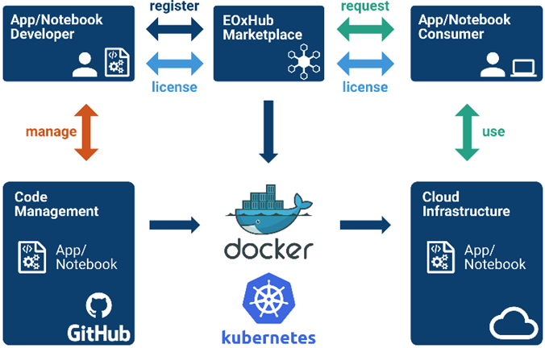

# FAIRiCUBE Architecture

## FAIRiCUBE Hub

The FAIRiCUBE Hub is based on the existing software named EOxHub, which is also used to power, e.g., the [EuroDataCube (EDC) Marketplace](https://eurodatacube.com/marketplace), the [EDC EOxHub Workspace](https://eurodatacube.com/marketplace/infra/edc_eoxhub_workspace) as well as [DeepESDL](https://www.earthsystemdatalab.net/).

EOxHub is a platform and workflow management runtime for Earth Observation services and apps. EOxHub can be branded to provide the FAIRiCUBE Hub & Marketplace and be deployed on any cloud offering a managed Kubernetes service. The designated cloud for FAIRiCUBE, Amazon Web Services (AWS) in the Europe Frankfurt region, fulfils this requirement with the managed
Elastic Kubernetes Service (EKS).

Technically EOxHub is split into the *Control Plane* and the *Worker Plane*. The Worker Plane is where all workloads from users are run at runtime.  

The *Control Plane* is configured to provide the following:

* User Management
* Access control
* User Workspaces (Tenants)
* Workspace Dashboard
* Service subscription management
* Marketplace
* Allocation functions for cloud resources and Data Services
* Deployment service
* Workload management functions
* Docker Image administration/assignment
* Example notebook catalogue supporting user contributions
* Automated verification of example notebooks
* Accounting and billing (voucher handling)

The figure shown below provides an Overview of the FAIRiCUBE Architecture.

    

Deploying user workloads on the *Worker Plane* is performed on configured autoscaling groups using the managed Elastic Container Service (ECS) of AWS. This setup ensures, that only actually required resources are used and thus need to be paid.

The figure above shows the App deployment in user Workspaces. The sequence of steps is: The App or Notebook Developer pushes the App source code to the Code Management tool, adds the App as Docker image, and registers the App at the Marketplace. 
The App Consumer discovers and requests the App and triggers the deployment of the App to use it to their workspace to be run on the cloud infrastructure. The App is now available to be used by the Consumer within the resources provided in their workspace subscription.

