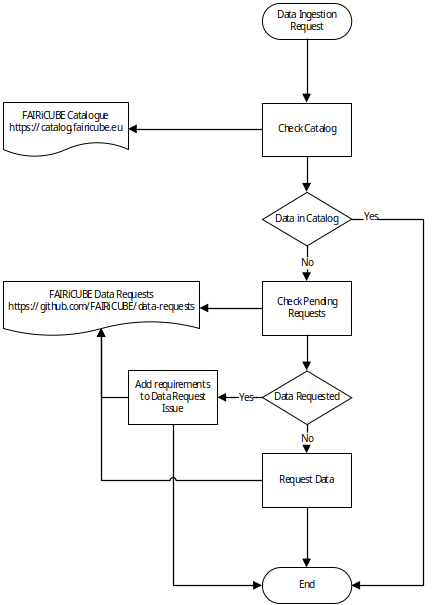
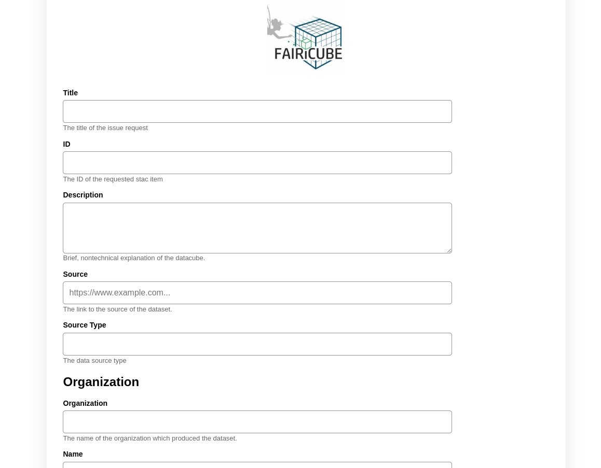

# Adding Datasets to the FAIRiCUBE

The FAIRiCUBE Catalog holds metadata for datasets as well as processes. Datasets are either local or external ones. Processes are either algorithms provided mainly as Jupyter notebooks, invokable models, or concrete deployed services or apps.

If a dataset or a process/analysis resource is not already available in FAIRiCUBE via one of the provided Datastores (e.g., AWS, DIASes, Euro Data Cube, EarthServer Fed., etc.) then a User can issue a Data Request to get the data ingested into FAIRiCUBE.

A user wishing to use a specific dataset on the FAIRiCUBE Hub should first take a look at the [FAIRiCUBE Catalog](https://catalog.eoxhub.fairicube.eu/?.language=en) to see if the dataset is already available and ready to be used. The contents of this FAIRiCUBE Catalog are maintained in a GitHub repository as static json files which are exposed via GitHub pages together with this danamic web interface, i.e. the STAC-fastapi Browser.

In case it is not yet listed in the catalog, the user should further consult the Data Access GitHub project (https://github.com/orgs/FAIRiCUBE/projects/1, Figure 21), to check if the dataset is already in a draft request state. In case the dataset is already listed on the project, the user can directly convert the draft into an issue in the Data Requests GitHub repository (https://github.com/FAIRiCUBE/data-requests) where progress is further tracked.

When the desired dataset is neither present in the FAIRiCUBE Catalog nor in the Data Access GitHub project, the user should request the dataset to be ingested by starting the **[FAIRiCUBE Dataset Request Form] (work in progress)** filling i the required details and submit the form.

EOX developed this WebGUI as an Input Frontend allowing to collect and edit the metadata for the data resources. The input from this Weg-GUI is collected, checked for consistency and errors and then directly stored as static STAC json items in GitHub. This ensures that all items stored in the GitHub repository act as the single Source of Truth. The same interface is also available to edit already ingested metadata items.

Once the respective item is stored n GitHub a review process is initiated where the metadata responsible will manually check the correctness of the input and, if verified, will apply the Label 'approved'. Once the item is labeled 'approved'  an automatic deployment procedure is available via GitHub pages and the content is directly harvested (STAC-fastapi/pgSTAC to provide a STAC API) and available via the Catalog Client, based on STAC Browser, accessible at: [https://catalog.fairicube.eu](https://catalog.eoxhub.fairicube.eu/?.language=en).

