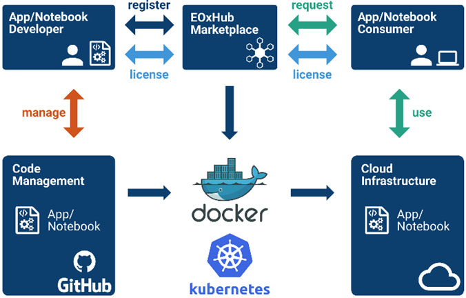

# FAIRICUBE Hub

The FAIRiCUBE Hub is based on the existing software named EOxHub, which is also used to power, e.g., the [EuroDataCube (EDC) Marketplace](https://eurodatacube.com/marketplace), the [EDC EOxHub Workspace](https://eurodatacube.com/marketplace/infra/edc_eoxhub_workspace) as well as [DeepESDL](https://www.earthsystemdatalab.net/).

EOxHub is a platform and workflow management runtime for Earth Observation services and apps. EOxHub can be branded to provide the FAIRiCUBE Hub & Marketplace and be deployed on any cloud offering a managed Kubernetes service. The designated cloud for FAIRiCUBE, Amazon Web Services (AWS) in the Europe Frankfurt region, fulfils this requirement with the managed
Elastic Kubernetes Service (EKS).

### Overview

* **[FAIRiCUBE Catalog](fic_catalog.md):** The integrated catalog providing metadata and references to ingested datasets, processes, and models available from FAIRiCUBE.
* **FAIRiCUBE Hub:** The overall FAIRiCUBE technical environment encompassing the FAIRiCUBE Catalog, FAIRiCUBE Services and Applications, as well as the FAIRiCUBE Lab.
* **FAIRiCUBE Workspace:** The user area within the FAIRiCUBE Lab where users are able to collaborate and share the content of their workspaces.
* **[FAIRiCUBE Lab](jupyterlab.md):** A single container for all workspaces providing the interface to back-ends via various back-end protocols as well as an execution environment for user provided workloads.
* **FAIRiCUBE Services/Apps:** Components providing various ways to access the data and processing facilities provided by FAIRiCUBE.
* **[FAIRiCUBE Knowledge Base](knowledgebase.md):** Provides a set of tools to enable appropriate knowledge of how to apply algorithms and ML techniques to solve similar demands.

    

The figure shown above provides an Overview of the overall FAIRiCUBE Architecture.

### Envisioned Data-Flow  in FAIRiCUBE

    

In the figure above an overview showing the flow of data and metadata within the FARiCUBE Hub system is given. Data provided will be submitted vi STAC-API to the STAC catalog holding the metadata. If required some pre-processing steps  (e.g. conversions, geographic transformations and if necessary some gap-filling procedures) might be applied to the respective dataset. Such pre-processing steps are especially useful to harmonize datasets (e.g. their resolution, projection, etc.) prior to ingestion.
Once pre-processing is finished data will be ingested into the data-store from where is will be readily available to further actions applied by the user. These include further data analysis, visualization and ML-Training. All results can be submitted into the storage for further usage or fed into ML-Models.

### FAIRiCUBE Hub

Technically EOxHub is split into the *Control Plane* and the *Worker Plane*. The Worker Plane is where all workloads from users are run at runtime.  

The *Control Plane* is configured to provide the following:

* User Management
* Access control
* User Workspaces (Tenants)
* Workspace Dashboard
* Service subscription management
* Marketplace
* Allocation functions for cloud resources and Data Services
* Deployment service
* Workload management functions
* Docker Image administration/assignment
* Example notebook catalogue supporting user contributions
* Automated verification of example notebooks
* Accounting and billing (voucher handling)

Deploying user workloads on the *Worker Plane *is performed on configured
autoscaling groups using the managed Elastic Container Service (ECS) of AWS.
This setup ensures, that only actually required resources are used and
thus need to be paid.

The figure above shows the App deployment in user Workspaces. The sequence of steps is: The App or Notebook Developer pushes the App source code to the Code Management tool, adds the App as Docker image, and registers the App at the Marketplace. 
The App Consumer discovers and requests the App and triggers the deployment of the App to use it to their workspace to be run on the cloud infrastructure. The App is now available to be used by the Consumer within the resources provided in their workspace subscription.

EOxHub is extended in two ways to provide the FAIRiCUBE *Collaborative Development Tools*:

* Extended support for teams as part of the multi-user plan. Allow for easier sharing of versioned notebooks and other artifacts within the team but not necessarily the public.
* Integrated support for Machine Learning (ML) workflows. This includes the versioning, sharing, and collaborative using of all ML artifacts like code, data, models, results, etc. Based on user feedback, the readily available Open-Source tools like Data Version Control (DVC), MLflow, Kubeflow, or similar, will be integrated during the project.
