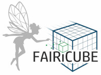

    

# Welcome to F.A.I.R. Information Cubes - FAIRiCUBE

The core mission of FAIRiCUBE is to enable players from beyond classic Earth Observation (EO) domains to provide, access, process and share gridded data and algorithms in a FAIR and TRUSTable manner.

The project’s goal is to leverage power of Machine Learning (ML) operating on multi-thematic datacubes for a broader range of governance and research institutions from diverse fields, who are at present cannot easily access and utilize these potent resources.

The objective is the creation of a FAIRiCUBE Hub, a crosscutting platform and framework for data ingestion, provision, analyses, processing and dissemination, to unleash the potential of environmental, biodiversity and climate data through dedicated European data spaces.

FAIRiCUBE use cases address EU green deal action items, focusing on urban and regional scale. The use cases are:

1. [Spatial and temporal assessment of neighbourhood building stock](use_cases/buildings.md)
2. [Biodiversity occurrence cubes](use_cases/biodiversity_cubes.md)
3. [Biodiversity and agriculture nexus](use_cases/biodiversity_agri.md)
4. [Urban adaptation to climate change](use_cases/urban_climate.md)
5. [Drosophila Genetics](use_cases/drosophila_genetics.md)

## Datacubes

The interpretation of the term datacube in the EO domain usually depends on the respective context. It may refer to a data service such as Sentinel Hub, to some abstract API, or to a concrete set of spatial images that form a time-series.

In the EO domain a datacube is a multi-dimensional array of values; examples include multi-terabyte/petabyte data warehouses and time series of image data. The data cube is used to represent data (sometimes called facts) along some dimensions of interest.

The concept of multidimensional datacubes can help overcome many challenges with respect to performance, scalability, interoperability, semantics, sampling, geo-referencing, and readiness for ML applications.

## FAIR processing and analysing

The challenge posed by the potential of multi-thematic datacubes pertains to processing; while established processing paradigms align well with the constrained datasets traditionally available. These must be rethought when confronting both the structure and sheer volume of data available in cube formats. 
Fortuitously, the experience and compute resources to run artificial intelligence (AI) and specifically machine learning (ML) applications have significantly evolved, developing from what was long seen as a buzzword for untransparent data analysis towards viable tools enabling the extraction of real value and insights from large and complex data collections.

Therefore, when providing data, processing functionality and data products to relevant stakeholders such as governmental authorities, civil society and NGOs, commercial players, or researchers, all these aspects must be considered. Following the **FAIR principles**, while data is becoming increasingly **findable**, **accessible**, and **interoperable**, true **reusability** depends on the availability and functionality of suitable processing mechanisms. 
As ever more decisions are taken based on live, historical, or synthetic data, applying the FAIR principles towards analysis and processing is essential in maintaining trust in the data and analyses underpinning these actions.  
In this project, we aim to advance the FAIRness of both data and data analysis and subsequent products by enhancing the reusability of existing data and applying the FAIR principles to advanced data analytics algorithms and concepts.

## Machine learning and datacubes

However, the broader potential of machine learning applied to multi-thematic datacubes has rarely been demonstrated. Most ML applications on datacubes focus on a limited number of data sources or often just temporal steps within one dataset.
FAIRiCUBE aims to deliver the power of datacubes and ML to decision makers and data scientists.
